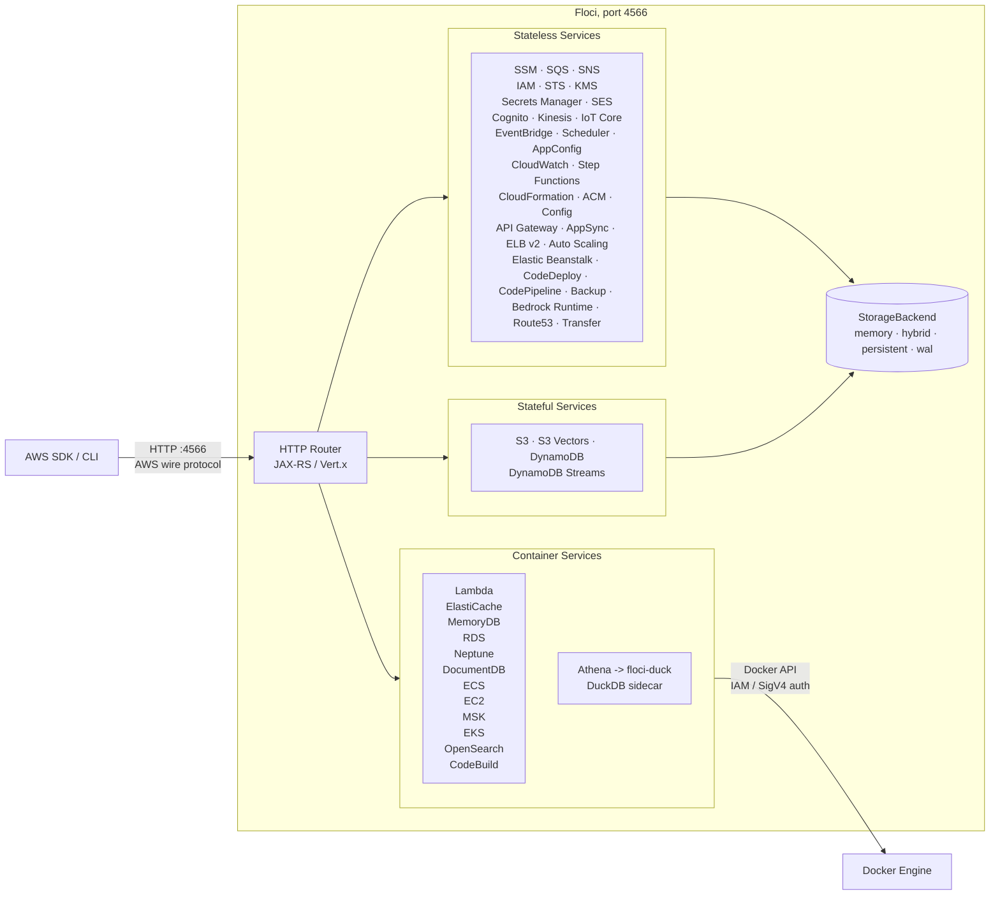

<p align="center">
  
  
</p>

<p align="center">
  <strong>Light, fluffy, and always free</strong><br />
  No account. No auth token. No feature gates. Just <code>docker compose up</code>.
</p>

<p align="center">
  <a href="https://github.com/floci-io/floci/releases/latest"></a>
  <a href="https://github.com/floci-io/floci/actions/workflows/release.yml"></a>
  <a href="https://hub.docker.com/r/floci/floci"></a>
  <a href="https://hub.docker.com/r/floci/floci"></a>
  <a href="https://opensource.org/licenses/MIT"></a>
  <a href="https://github.com/floci-io/floci/stargazers"></a>
</p>

# Floci CTF

A security-hardened fork of [Floci](https://github.com/floci-io/floci) (upstream **1.5.33** at tip `fba4d8f5`, merged 2026-07-15) for capture-the-flag and security exercises. Same local AWS emulator on port **4566**, with IAM enforcement, strict policy mode, SigV4 validation, and CTF-specific controls so participants cannot rely on permissive `test`/`test` credentials, unsigned requests, or internal introspection routes.

For service coverage, architecture, SDK examples, and general configuration, use the [upstream Floci README](https://github.com/floci-io/floci/blob/main/README.md) and [docs](https://floci.io/floci/). For operators, agents, and `floci:local` behavior, see [AGENTS.md](./AGENTS.md).

## What changed

| Area | Upstream Floci | This fork |
|---|---|---|
| IAM enforcement | Off by default | On in `docker-compose.yml` |
| S3 `enforce-auth` (`FLOCI_SERVICES_S3_ENFORCE_AUTH`) | Off by default (public-ACL / bucket-policy path for unsigned reads) | Default remains `false` in YAML. Compose CTF relies on IAM + SigV4 (`IamEnforcementFilter`), not this flag |
| Strict IAM mode | Off by default | On: denies unregistered keys and unknown action mappings |
| SigV4 on API calls | Off by default | On: validates `Authorization` signatures |
| Operator bypass | N/A | `FLOCI_AUTH_ROOT_*` pair bypasses enforcement for provisioning |
| S3 pre-signed URLs | Default HMAC secret or 12-digit account id in credential | SigV4 query auth; **generated** URLs signed with operator root AKIA; **inbound** presigned requests resolve account from `X-Amz-Credential`; operator root secret takes precedence over IAM when AKID matches `FLOCI_AUTH_ROOT_*` |
| Docker image defaults | `test`/`test` baked in; optional `floci`/`floci` deployer | No default credentials in `docker/Dockerfile`; deployer principal not seeded when IAM enforcement is on |
| Payload hashing | N/A | SigV4 validator hashes request bodies when `x-amz-content-sha256` is absent |
| `sts:GetCallerIdentity` / `GetSessionToken` | Evaluated like any action | Policy-exempt (AWS parity): no Allow required; SigV4 and registered keys still apply |
| `sts:GetCallerIdentity` response | Often returns account `:root` | Returns the **calling principal** (IAM user, assumed role, federated user, operator root, or 12-digit account id) |
| Role trust `sts:ExternalId` | Not enforced | Trust policy conditions evaluated on `AssumeRole` |
| Resource-based policies | Not enforced on HTTP | S3/Lambda/SQS/SNS/KMS/Secrets resource policies in `IamEnforcementFilter`; presigned S3 uses SigV4 query auth then evaluates bucket policy; `NotPrincipal` supported; account `:root` in resource policies does **not** directly allow IAM users (identity policy still required) |
| Scoped IAM `Resource` ARNs | Most requests use `*` | `ResourceArnBuilder` maps per-service ARNs on HTTP `:4566` (core data plane plus RDS Data API, EMR, WAFv2, Transfer, CloudFront, Bedrock runtime, Transcribe, CUR, BCM Data Exports, AppConfig, Textract, tagging multi-ARN, and others; `pricing`/`ce`/`ec2messages` stay `*` per AWS) |
| Health `services` map | Lists all services as `running` or `available` | Only **enabled** services appear as `running`; disabled services omitted |
| Internal introspection routes | `/_floci/*`, `/_localstack/*`, `/health` open | Default `FLOCI_CTF_HIDE_INTERNAL_ENDPOINTS=true` hides `/_floci/*`, `/_localstack/*`, and `/_aws/*`; `all` also hides `/health` |
| Temporary creds (`ASIA*`) | Secret key alone | `x-amz-security-token` required and validated when SigV4 is on |
| Docker `HEALTHCHECK` | `/_floci/health` | `GET /health` (works when internal routes are hidden) |
| Container env (Lambda, ECS, CodeBuild) | Function/task/build env can set `AWS_*`; upstream may forward host `AWS_*` | `LaunchedContainerAwsEnv` never injects `test`/`test`; `OperatorCredentialEnv` adds operator keys only when no execution/task/build role; `ContainerEnvHardening` strips participant `AWS_*`; roles get `AWS_CONTAINER_CREDENTIALS_FULL_URI` (ports 9171/9172/9170) |
| EKS kubectl token webhook | Any `k8s-aws-v1.*` accepted as cluster-admin | Hidden under `/_floci/*` by default; with IAM enforcement on, requires SigV4-valid presigned STS `GetCallerIdentity` URL (`EksTokenValidator`) |
| Secrets Manager + KMS | Returns nested/double-wrapped `SecretBinary`; hierarchical `path-*` IAM wildcards | Single-layer `SecretBinary`; stored secret ARN with six-char suffix for IAM; path prefixes use `secret:path/*` per [AWS IAM examples](https://docs.aws.amazon.com/secretsmanager/latest/userguide/auth-and-access_examples.html); pass raw bytes to SDK `SecretBinary` |
| SQS scoped `ReceiveMessage` | JSON 1.0 `QueueUrl` ignored for IAM (scoped policies fail) | Queue ARN from Query form **and** JSON 1.0 body `QueueUrl`; account from URL path |
| CloudTrail SQS audit | `requestParameters.queueUrl` on Query API only | `queueUrl` and `messageBody` on Query and JSON 1.0 SQS calls (`CloudTrailEventRecorder`) |
| SQS `ListQueues` IAM deny | May surface as `ServiceNotAvailableException` | HTTP 403 `AccessDenied` (Query XML or JSON `AccessDeniedException`) when identity policy denies `sqs:ListQueues` |
| IAM credential / KMS key material | `ThreadLocalRandom` for access keys, STS sessions, container creds, `GenerateDataKey`, grant tokens | `SecureRandom` / service CSPRNG for all of the above |
| IAM policy `*` / `?` matching | Recursive backtracking (exponential on multi-wildcard patterns) | Linear-time DP matcher in `IamPolicyEvaluator.globMatches` |

**Fork-only code (high level):** `IamEnforcementFilter`, `SigV4ValidationFilter`, `AccountResolver`, `AccountContextFilter`, `PreSignedUrlFilter`, `PreSignedUrlGenerator` (SigV4 with operator root AKIA), `PolicyPrincipalMatcher`, `FederatedTokenParser`, `ResourcePolicyResolver`, `ResourceArnBuilder`, `AssumeRoleTrustPolicyEvaluator`, `InProcessIamAuthorizer`, `InProcessTargetAuthorizer`, `CtfInternalEndpointFilter`, `LaunchedContainerAwsEnv`, `OperatorCredentialEnv`, `ContainerEnvHardening`, `LambdaContainerCredentialsServer`, `EcsContainerCredentialsServer`, `CodeBuildContainerCredentialsServer`, `EksTokenValidator`, `SecretsManagerKmsSupport`. Map: [AGENTS.md](./AGENTS.md#ctf-implementation-map).

After each upstream merge, re-verify CTF hardening on conflict-prone files (`SnsService`, `EcsContainerManager`, `docker-compose.yml`, IAM filters). See [AGENTS.md](./AGENTS.md#upstream-sync).

### 1.5.33 parity notes

- EKS supports managed node groups and Fargate profile create, describe, list, and delete operations.
- Shutdown tears down process-bound containers. Persistent storage paths fail fast when they are not writable.
- S3 honors ACL headers and supported explicit grant headers. `s3:ListBucket` IAM conditions receive `s3:prefix`, `s3:delimiter`, and `s3:max-keys` from the request.
- Scheduler forwards `MessageAttributes` to universal SNS publish targets. `ImportKeyPair` rejects duplicate key pair names.
- ELBv2 reports target health reasons. CloudFormation carries SAM function `PackageType` and `ImageConfig`, and resolves ECS container secrets.
- RDS returns `DBSubnetGroupNotFoundFault` when a named subnet group does not exist.

## Quick start (operators)

Export operator secrets on the host, then start Compose:

```bash
export FLOCI_AUTH_ROOT_ACCESS_KEY_ID="AKIA..."
export FLOCI_AUTH_ROOT_SECRET_ACCESS_KEY="..."
export AWS_ACCESS_KEY_ID="$FLOCI_AUTH_ROOT_ACCESS_KEY_ID"
export AWS_SECRET_ACCESS_KEY="$FLOCI_AUTH_ROOT_SECRET_ACCESS_KEY"

docker compose up
```

Compose mounts the host Docker socket (`/var/run/docker.sock`) so Lambda and EC2 container runtimes can start workloads. For a custom `docker run`, pass the same mount or set `DOCKER_HOST` (on Windows with Docker Desktop: `npipe:////./pipe/docker_engine`). Without Docker access, workloads that depend on container runtimes will not start.

All AWS services listen on `http://localhost:4566`. Use the root credentials only for operator provisioning. Issue participant credentials via IAM (`CreateAccessKey`) and scoped policies.

## Required environment variables

| Variable | Purpose |
|---|---|
| `FLOCI_SERVICES_IAM_ENFORCEMENT_ENABLED` | `true` in repo Compose: evaluate IAM on every call |
| `FLOCI_SERVICES_IAM_STRICT_ENFORCEMENT_ENABLED` | `true`: no permissive fall-through for unknown actions or missing auth |
| `FLOCI_AUTH_VALIDATE_SIGNATURES` | `true`: verify SigV4 on inbound API requests |
| `FLOCI_AUTH_ROOT_ACCESS_KEY_ID` | Operator access key (bypasses enforcement when paired with secret) |
| `FLOCI_AUTH_ROOT_SECRET_ACCESS_KEY` | Operator secret for the root access key |
| `FLOCI_CTF_HIDE_INTERNAL_ENDPOINTS` | Default `true`: `404` on `/_floci/*`, `/_localstack/*`, and `/_aws/*`; `all` also hides `/health`; set `false` for upstream-style introspection |
| `FLOCI_AUTH_TRUST_FORWARDED_HEADERS` | Optional; default `false`. When `true`, `X-Forwarded-For` may set `aws:sourceip` in IAM conditions |
| `FLOCI_CTF_CONTAINER_CREDENTIALS_USE_LINK_LOCAL_URI` | Default `true`: inject `http://169.254.170.2:9171/v2/credentials/...` URIs. Floci adds `extra_hosts` on spawned Lambda/ECS/CodeBuild containers automatically (`169.254.170.2:host-gateway` on native Docker, or `169.254.170.2:<floci-container-ip>` when Floci runs in Compose) |
| `FLOCI_CTF_VALIDATE_FEDERATED_TOKENS` | Optional; default `false`. When `true`, structural JWT/SAML checks plus optional HS256/RS256 verification via `FLOCI_CTF_FEDERATED_JWT_*` |
| `FLOCI_DEFAULT_ACCOUNT_ID` | Optional; account id in IAM ARNs and `GetCallerIdentity` (default `000000000000`) |

These are set in [docker-compose.yml](./docker-compose.yml). Pass root credentials from the host as shown above.

## Operator workflow

1. Start Floci with the CTF env vars. Keep root credentials private.
2. Provision resources with the root pair (bypasses strict enforcement when both match):

```bash
export AWS_ENDPOINT_URL=http://localhost:4566
export AWS_ACCESS_KEY_ID="$FLOCI_AUTH_ROOT_ACCESS_KEY_ID"
export AWS_SECRET_ACCESS_KEY="$FLOCI_AUTH_ROOT_SECRET_ACCESS_KEY"

aws iam create-user --user-name participant-user
aws iam create-access-key --user-name participant-user
# attach policies, create buckets, Lambda functions, etc.
```

3. Give participants IAM access keys from `CreateAccessKey`. They must sign every request with SigV4.
4. Confirm enforcement: wrong secret or unregistered keys should return HTTP 403.
5. Operator smoke (default hide hides `/_floci/health`):

```bash
curl -s http://localhost:4566/health | jq .services
```

6. Confirm identity shape (participant keys must **not** report account root unless that is intentional):

```bash
# As participant (briefing AKIA only — not operator root)
aws sts get-caller-identity --endpoint-url "$AWS_ENDPOINT_URL"
# Expect Arn like arn:aws:iam::ACCOUNT:user/participant-user — not ...:root
```

Under strict mode, `test`/`test`, `floci`/`floci`, and other unregistered keys are rejected. Only IAM identities allowed by policy (or the configured root pair) succeed.

AWS-intentional unsigned invoke is limited to explicit public surfaces (S3 bucket policy read, API Gateway `authorizationType=NONE`, Lambda function URL `AuthType=NONE` with a public resource policy). See [docs/services/iam.md](./docs/services/iam.md#anonymous-access-exceptions).

**STS notes:** Participants do **not** need `sts:GetCallerIdentity` or `sts:GetSessionToken` in IAM policies (same as AWS). Operator `FLOCI_AUTH_ROOT_*` resolves to `arn:aws:iam::ACCOUNT:root`. Set `FLOCI_DEFAULT_ACCOUNT_ID` when using a non-default account id in ARNs.

<details>
<summary>Using the old <code>hectorvent/floci</code> image?</summary>

Update your image name:

```yaml
# Before
image: hectorvent/floci:latest

# After
image: floci/floci:latest
```

The old `hectorvent/floci` repository no longer receives updates.

</details>

## Features

<details open>
<summary><strong>Local AWS without the cloud account</strong></summary>

Run AWS-compatible services locally without an AWS account, auth token, or paid feature gates.

</details>

<details>
<summary><strong>Real Docker where fidelity matters</strong></summary>

Lambda, RDS, Neptune, ElastiCache, MSK, ECS, EC2, EKS, OpenSearch, and CodeBuild use real Docker-backed execution instead of shallow mocks.

</details>

<details>
<summary><strong>Drop-in AWS compatibility</strong></summary>

Point standard AWS clients at `http://localhost:4566`. Existing credentials, regions, SDKs, CLI commands, and IaC workflows stay familiar.

</details>

<details>
<summary><strong>Fast enough for CI</strong></summary>

The native image starts in milliseconds and keeps idle memory low, making it practical for local development and test pipelines.

</details>

<details>
<summary><strong>Configurable persistence</strong></summary>

Choose from in-memory, persistent, hybrid, and write-ahead log storage depending on the durability profile you need.

</details>

## Why Floci?

LocalStack's community edition [sunset in March 2026](https://blog.localstack.cloud/the-road-ahead-for-localstack/), requiring auth tokens and freezing security updates. Floci is the no-strings-attached alternative.

| Capability | Floci | LocalStack Community |
|---|:---:|:---:|
| Auth token required | No | Yes |
| Security updates | Yes | Frozen |
| Startup time | ~24 ms | ~3.3 s |
| Idle memory | ~13 MiB | ~143 MiB |
| Docker image size | ~90 MB | ~1.0 GB |
| License | MIT | Restricted |
| API Gateway v2 / HTTP API | Yes | No |
| Cognito | Yes | No |
| RDS, ElastiCache, MemoryDB, MSK | Real Docker | No |
| Neptune (Gremlin and openCypher) | Real Docker | No |
| DocumentDB (MongoDB-compatible) | Real Docker | No |
| ECS, EC2, EKS | Real Docker | No |
| CodeBuild | Real Docker execution | No |
| Native binary | ~40 MB | No |

**69 AWS services. Broad coverage. Free forever.**

## Architecture Overview



## Supported Services

Floci supports local emulation for application services, data services, eventing, identity, infrastructure, billing, and container-backed workloads.

| Category | Services |
|---|---|
| Core app services | S3, S3 Vectors, SQS, SNS, DynamoDB, Lambda, IAM, STS, KMS, Secrets Manager, SSM |
| Events and workflows | EventBridge, EventBridge Pipes, EventBridge Scheduler, Step Functions, CloudWatch Logs, CloudWatch Metrics |
| API and identity | API Gateway REST, API Gateway v2, AppSync, Cognito, ACM, Route53, Cloud Map |
| Containers and compute | ECS, EC2, Lightsail, EKS, ECR, CodeBuild, CodeDeploy, CodePipeline, AWS Batch, Auto Scaling, Elastic Beanstalk, ELB v2 |
| Data, analytics, and AI | Athena, Glue, EMR, Firehose, OpenSearch, S3 Vectors, Textract, Transcribe, Bedrock Runtime |
| Databases and caching | RDS, RDS Data API, Neptune, DocumentDB, MemoryDB, ElastiCache |
| Messaging and transfer | SES, Kinesis, MSK, Amazon MQ, Transfer Family, IoT Core |
| Security and governance | WAF v2, CloudTrail, CloudFront, Resource Groups Tagging API |
| Cost and billing | Pricing, Cost Explorer, Cost and Usage Reports, BCM Data Exports |
| Backup and config | AWS Backup, AWS Config, AppConfig, AppConfigData, CloudFormation, Cloud Control API |

For operation-level compatibility, see the [Services Overview](https://floci.io/floci/services/).

<details>
<summary>Detailed service notes</summary>

| Service | How it works | Notable features |
|---|---|---|
| SSM | In-process + EC2 containers | Parameter Store (version history, labels, SecureString, tagging); Run Command (SendCommand, GetCommandInvocation, direct EC2 container execution, agent polling) |
| SQS | In-process | Standard and FIFO queues, DLQ, visibility timeout, batch operations, tagging |
| SNS | In-process | Topics, subscriptions, SQS, Lambda and HTTP delivery, tagging |
| S3 | In-process | Versioning, multipart upload, pre-signed URLs, Object Lock, event notifications, bucket logging configuration |
| S3 Vectors | In-process | Vector buckets, indexes, put/get/list/delete vectors, similarity query |
| DynamoDB | In-process | GSI, LSI, Query, Scan, TTL, transactions, batch operations, TableId, TableClass, OnDemandThroughput, deletion protection |
| DynamoDB Streams | In-process | Shard iterators, records, Lambda event source mapping trigger |
| Lambda | Real Docker | Runtime environment, execution model, warm container pool, aliases, Function URLs |
| API Gateway REST | In-process | Resources, methods, stages, Lambda proxy, MOCK integrations, AWS integrations |
| API Gateway v2 | In-process | HTTP APIs, routes, integrations, JWT authorizers, stages, cascade delete |
| AppSync | In-process | GraphQL API management API, schema registry, AWS scalars, domain names, channel namespaces; `$util` runtime library for VTL resolvers |
| AWS IoT Core | In-process + MQTT broker | Thing/certificate/policy lifecycle, device shadows, topic rules, IoT Data publish; embedded Vert.x MQTT broker |
| IAM | In-process | Users, roles, groups, policies, instance profiles, access keys |
| STS | In-process | AssumeRole, WebIdentity, SAML, GetFederationToken, GetSessionToken |
| Cognito | In-process | User pools, app clients, auth flows, JWKS and OpenID well-known endpoints; `AdminUserGlobalSignOut`, `GlobalSignOut`, and `RevokeToken` with `jti` / `origin_jti` revocation |
| KMS | In-process | Encrypt, decrypt, sign, verify, data keys, aliases; typed `KeySpec` / `KeyUsage` enums and signing algorithms in key metadata |
| Kinesis | In-process | Streams, shards, enhanced fan-out, split and merge |
| Secrets Manager | In-process | Versioning, resource policies, tagging, automatic rotation lifecycle via Lambda |
| Step Functions | In-process | ASL execution, task tokens, execution history, JSONata `Assign` workflow variables |
| CloudFormation | In-process | Stacks, change sets, resource provisioning, StackSets (cross-account instances), SAM Globals merge, implicit API from Api events |
| EventBridge | In-process | Custom buses, rules, SQS, SNS and Lambda targets |
| EventBridge Pipes | In-process | Poller-based integration connecting SQS, Kinesis, DynamoDB Streams, and MSK/Kafka (`smk://`) sources to targets with optional filtering |
| EventBridge Scheduler | In-process | Schedule groups, schedules, flexible time windows, retry policies, DLQs |
| CloudWatch Logs | In-process | Log groups, streams, ingestion, filtering |
| CloudWatch Metrics | In-process | Custom metrics, statistics, alarms |
| ElastiCache | Real Docker | Redis / Valkey protocol, IAM auth, SigV4 validation |
| MemoryDB | Real Docker | Redis / Valkey protocol via real containers; JSON 1.1 control plane with ACLs and users; reuses ElastiCache RESP proxy |
| RDS | Real Docker | PostgreSQL, MySQL, MariaDB, IAM auth, JDBC-compatible engines |
| RDS Data API | REST JSON over real RDS containers | Raw SQL execution and transactions for local MySQL / MariaDB RDS resources |
| Neptune | Real Docker | Graph DB via TinkerPop Gremlin Server (default) or Neo4j for openCypher/Bolt (`NEPTUNE_DB_TYPE`); RDS-shaped control plane; SigV4 proxy on port 8182 |
| DocumentDB | Real Docker, mock mode available | MongoDB-compatible cluster via real MongoDB containers; RDS-shaped control plane; MongoDB wire protocol on port 27017 |
| MSK | Real Docker | Kafka-compatible broker via Redpanda |
| Amazon MQ | Real Docker | RabbitMQ broker via rabbitmq:3-management; AMQP + management console |
| Athena | In-process with DuckDB sidecar | Real SQL execution over S3 and Glue-backed views; partition keys in table metadata |
| Glue | In-process | Data Catalog, Schema Registry, tables consumed by Athena |
| EMR | In-process | Cluster (job flow) lifecycle, instance groups and fleets, steps, security configurations, tagging |
| Data Firehose | In-process | Streaming delivery, NDJSON flush to S3 |
| ECS | Real Docker | Clusters, task definitions, tasks, services, capacity providers, task sets; durable control-plane state persisted via `StorageBackedMap` |
| EC2 | Real Docker | RunInstances launches containers, SSH key injection, UserData, IMDS, VPC resources, Network ACLs; empty `stateReason` omitted in DescribeInstances |
| Lightsail | In-process | Instances, disks, static IPs, key pairs, ports, tags, regions, blueprints, bundles, operations |
| ACM | In-process | Certificate issuance and validation lifecycle; persisted across restart |
| ECR | In-process with real registry | Repositories, docker push / pull, image-backed Lambda functions |
| Resource Groups Tagging API | In-process | GetResources, tag and untag resources, tag key and value discovery across services |
| SES | In-process | Send email, raw email, identity verification, DKIM, templates; v1 configuration-set tracking, reputation-metrics, and delivery options |
| SES v2 | In-process | REST JSON API, identities, DKIM, account sending, templates, dedicated IP pools, configuration-set option groups |
| OpenSearch | Real Docker | Domain CRUD, tags, versions, instance types, upgrade stubs |
| AppConfig | In-process | Applications, environments, profiles, hosted versions, deployments |
| AppConfigData | In-process | Configuration sessions and dynamic configuration retrieval |
| Bedrock Runtime | In-process stub | Dummy Converse and InvokeModel responses for local development |
| EKS | Real Docker, mock mode available | k3s clusters with live Kubernetes API server |
| ELB v2 | In-process | ALB, NLB, target groups, listeners, routing rules, Lambda targets, tags |
| CodeBuild | In-process with real Docker | Real buildspec execution, CloudWatch logs, S3 artifacts; projects, report groups, and source credentials persisted |
| CodeDeploy | In-process with Lambda traffic shifting | Deployment groups, configs, lifecycle hooks, auto-rollback |
| CodePipeline | In-process orchestration | Pipelines, executions, S3 artifacts, approvals, local providers, custom workers |
| AWS Batch | In-process | Compute environments, job queues, job definitions, job submission and lifecycle |
| Auto Scaling | In-process with reconciler | Launch configs, ASGs, desired capacity reconciliation, instance refresh, mixed-instances policy, lifecycle hooks; rejects launch templates without image IDs |
| Elastic Beanstalk | In-process | Applications, application versions, environments, configuration templates, platform and solution stack metadata |
| AWS Backup | In-process | Vaults, backup plans, selections, simulated job lifecycle, recovery points |
| AWS Config | In-process | Config rules, configuration recorders, delivery channels, conformance packs, tagging; rules, recorders, channels, and tags persisted across restart |
| CloudTrail | In-process | Trail lifecycle, event selectors (`GetEventSelectors` defaults), logging status; management API only |
| CloudFront | In-process | Distributions, origins, cache behaviors, invalidations, tagging |
| WAF v2 | In-process | Web ACLs, IP sets, regex pattern sets, rule groups, logging configs, resource associations, tagging (REGIONAL and CLOUDFRONT scopes) |
| Route53 | In-process | Hosted zones, SOA and NS records, resource record sets, change tracking, tagging |
| Cloud Map | In-process | HTTP and DNS namespaces, services, instance registration, discovery queries, operations, tagging |
| Transfer Family | In-process | Server lifecycle, user management, SSH key import, tagging |
| Textract | In-process stub | API-compatible stubs, dummy block data, async job simulation |
| Transcribe | In-process stub | Transcription jobs and custom vocabularies; jobs complete immediately, no real audio processing |
| Pricing | In-process with static snapshot | Product discovery, attributes, price list files, pagination |
| Cost Explorer | In-process | Cost synthesized from Floci resource state and pricing snapshots |
| Cost and Usage Reports | In-process with floci-duck sidecar | CUR 2.0 and FOCUS 1.2 columns, account-scoped storage, Parquet emission |
| BCM Data Exports | In-process | Export lifecycle, executions, update and delete operations |

</details>

## Real Docker Integration

Floci uses real Docker containers when in-process emulation would reduce fidelity. This applies to stateful databases, connection-heavy protocols, runtimes, and build systems.

| Service | Default image | What is real |
|---|---|---|
| Lambda | `public.ecr.aws/lambda/<runtime>` | AWS runtime environment, execution model, warm container pool |
| ElastiCache | `valkey/valkey:8` | Redis / Valkey protocol, ACL-based IAM auth, SigV4 validation |
| MemoryDB | `valkey/valkey:8` | Valkey protocol via real containers; JSON 1.1 control plane; RESP proxy |
| RDS PostgreSQL | `postgres:16-alpine` | PostgreSQL engine, IAM auth, JDBC-compatible access |
| RDS MySQL / Aurora | `mysql:8.0` | MySQL engine, IAM auth, JDBC-compatible access |
| RDS MariaDB | `mariadb:11` | MariaDB engine, IAM auth, JDBC-compatible access |
| Neptune | `tinkerpop/gremlin-server:3.7.3` | TinkerPop Gremlin Server; Gremlin WebSocket on port 8182; SigV4 auth proxy |
| Neptune (openCypher) | `neo4j:5-community` | Neo4j backend when `FLOCI_SERVICES_NEPTUNE_DB_TYPE=neo4j`; openCypher over Bolt |
| DocumentDB | `mongo:7.0` | MongoDB engine; MongoDB wire protocol on port 27017 |
| MSK | `redpandadata/redpanda:latest` | Kafka-compatible broker via Redpanda |
| EC2 | AMI-mapped Linux images | Linux containers, SSH key injection, UserData, IMDS, IAM credentials |
| ECS | User-specified task image | Container lifecycle, start, stop, health checks |
| EKS | `rancher/k3s:latest` | Kubernetes API server via k3s |
| CodeBuild | User-specified environment image | Buildspec execution, log streaming, S3 artifact upload |
| OpenSearch | `opensearchproject/opensearch:2` | Full OpenSearch engine with REST API |
| ECR | `registry:2` | OCI-compatible registry for docker push and docker pull |

Docker-backed services require the Docker socket:

```bash
docker compose up
```

### Overriding default images

| Variable | Default |
|---|---|
| `FLOCI_SERVICES_ELASTICACHE_DEFAULT_IMAGE` | `valkey/valkey:8` |
| `FLOCI_SERVICES_RDS_DEFAULT_POSTGRES_IMAGE` | `postgres:16-alpine` |
| `FLOCI_SERVICES_RDS_DEFAULT_MYSQL_IMAGE` | `mysql:8.0` |
| `FLOCI_SERVICES_RDS_DEFAULT_MARIADB_IMAGE` | `mariadb:11` |
| `FLOCI_SERVICES_MSK_DEFAULT_IMAGE` | `redpandadata/redpanda:latest` |
| `FLOCI_SERVICES_OPENSEARCH_DEFAULT_IMAGE` | `opensearchproject/opensearch:2` |
| `FLOCI_SERVICES_NEPTUNE_DEFAULT_IMAGE` | `tinkerpop/gremlin-server:3.7.3` |
| `FLOCI_SERVICES_NEPTUNE_DEFAULT_NEO4J_IMAGE` | `neo4j:5-community` |
| `FLOCI_SERVICES_DOCDB_DEFAULT_IMAGE` | `mongo:7.0` |
| `FLOCI_SERVICES_EKS_DEFAULT_IMAGE` | `rancher/k3s:latest` |
| `FLOCI_SERVICES_ECR_REGISTRY_IMAGE` | `registry:2` |
| `FLOCI_ECR_BASE_URI` | `public.ecr.aws` |

## Persistence and Storage Modes

Floci can trade speed for durability depending on the workflow. Configure the default mode with `FLOCI_STORAGE_MODE`, or override storage per service.

| Mode | Behavior | Best for | Durability |
|---|---|---|:---:|
| `memory` | Entirely in RAM. Data is lost when the container stops. | CI and ephemeral tests | None |
| `persistent` | Loaded at startup and flushed to disk immediately on every write operation. | Simple local state preservation with immediate persistence | Medium |
| `hybrid` | In-memory performance with periodic async flushing every 5 seconds. | Local development | Good |
| `wal` | Write-ahead log. Every mutation is logged before responding. | Maximum durability | Highest |

Use `memory` for fast test runs. Use `hybrid` when you want state preserved across container restarts without much overhead. Recent upstream fixes persist durable metadata for **AWS Config** (rules, conformance packs, recorders, delivery channels, tags), **ECS** (clusters, task definitions, services), **CodeBuild** (projects, report groups, source credentials), and **EC2** spot and flow-log state via `StorageBackedMap` / configured storage backends.

For more detail, see the [Storage Configuration documentation](https://floci.io/floci/configuration/storage/).

## Multi-Account Isolation

Floci supports per-account resource isolation with no extra setup. If `AWS_ACCESS_KEY_ID` is exactly 12 digits, Floci uses it as the account ID. Inbound S3 presigned URLs can also carry a 12-digit account id in `X-Amz-Credential` (`AccountContextFilter`). STS temporary credentials route to the assumed role's account (or the minting caller's account for `GetSessionToken`); resolution precedence is 12-digit AKID, temporary-session lookup, then `FLOCI_DEFAULT_ACCOUNT_ID`. Resources created by one account are invisible to another. CTF presigned URL **generation** still uses the operator root access key id for SigV4 signing.

See [docs/configuration/multi-account.md](./docs/configuration/multi-account.md).

## Audit and forensics profile

The root [docker-compose.yml](./docker-compose.yml) layers audit defaults on top of CTF hardening so audit artifacts and service metadata survive restarts:

| Variable | Compose value | Purpose |
|---|---|---|
| `FLOCI_STORAGE_MODE` | `hybrid` | Async flush of service state to `./data` (mounted at `/app/data`) |
| `FLOCI_SERVICES_CLOUDTRAIL_AUDIT_ENABLED` | `true` | Record HTTP and in-process API calls to active CloudTrail trails |

Operator setup for a typical evidence chain:

1. Start Compose with operator root credentials (see [Quick start](#quick-start-operators)).
2. Create an S3 bucket, optional SQS queue, and bucket notifications for trail delivery ([CloudTrail docs](./docs/services/cloudtrail.md)).
3. `CreateTrail`, `StartLogging`, and exercise the scenario; review gzip JSON under `AWSLogs/{account-id}/CloudTrail/...` in the trail bucket.
4. Use `LookupEvents` or Athena over trail objects to correlate participant HTTP calls with **inter-service** activity (Step Functions tasks, EventBridge targets, Firehose flushes, Config snapshots) recorded with `invokedBy` service principals.

Inter-service audit (when audit is enabled and a trail is logging): Step Functions and API Gateway in-process SDK calls use the execution role plus `invokedBy` (`states.amazonaws.com`, `apigateway.amazonaws.com`). Internal delivery (Firehose to S3, SNS to SQS, CloudWatch Logs subscriptions, S3 access logs) uses `userIdentity.type=AWSService`. See [CloudTrail inter-service events](./docs/services/cloudtrail.md#inter-service-events-in-process-audit).

Hardening: IAM enforcement and SigV4 still apply independently of audit recording. `StopLogging` and `DeleteTrail` are audited and can trigger GuardDuty `DefenseEvasion` findings. CloudTrail IAM actions scope to trail ARNs (`cloudtrail:StopLogging` on `arn:aws:cloudtrail:...:trail/name`). SQS audit events include `requestParameters.queueUrl` and `messageBody` on `SendMessage` (Query and JSON 1.0) so `LookupEvents` can correlate queue-scoped activity. Trail S3 delivery evaluates bucket policy `aws:SourceArn` and `s3:x-amz-acl` conditions for `cloudtrail.amazonaws.com`.

5. Optional: configure [AWS Config](./docs/services/config.md) delivery channels for configuration snapshots in S3.

Enable S3 access logging for data-plane evidence ([S3 access logging](./docs/services/s3.md#access-logging)). Optional [GuardDuty](./docs/services/guardduty.md) and [Security Hub](./docs/services/securityhub.md) aggregate findings from CloudTrail-driven rules and ASFF imports.

Forensic regression (with CTF core tests):

```bash
./mvnw test -Dtest=CloudForensicsIntegrationTest,CloudTrailIntegrationTest,CloudTrailAuditIntegrationTest,CloudTrailTamperingAuditIntegrationTest,CloudTrailIamScopedIntegrationTest,CloudTrailLookupEventsScopedIamIntegrationTest,CloudTrailSqsAuditIntegrationTest,CloudTrailKmsDecryptAuditIntegrationTest,CloudTrailSnsPublishAuditIntegrationTest,CloudTrailDynamoDbPutItemAuditIntegrationTest,InProcessCloudTrailIntegrationTest,InternalServiceCloudTrailIntegrationTest,CloudTrailLookupEventsIntegrationTest,ConfigSnapshotDeliveryIntegrationTest,S3AccessLoggingIntegrationTest,S3AccessLogSourceIpParityIntegrationTest,Ec2FlowLogsIntegrationTest,CloudWatchLogsSubscriptionIntegrationTest,GuardDutyIntegrationTest,SecurityHubIntegrationTest,SecretsManagerKmsEnvelopeIntegrationTest,SecretsManagerKmsSupportTest,SecretsManagerGetSecretValueScopedArnIntegrationTest,SecretsManagerRotationKmsIntegrationTest,KmsDecryptScopedKeyIntegrationTest,DynamoDbGetItemQueryScopedIntegrationTest,DynamoDbPutItemScopedIntegrationTest,SnsSubscribeReceiveIamIntegrationTest,SnsPublishScopedIamIntegrationTest,SqsReceiveMessageScopedQueueIntegrationTest,SqsResourcePolicyOnlyAllowIntegrationTest,StsGetCallerIdentityIntegrationTest,CtfComposeParityIntegrationTest,IamEnforcementIntegrationTest
```

Compatibility probes against a running instance ([compatibility-tests/README.md](./compatibility-tests/README.md)):

```bash
cd compatibility-tests && cp env.example .env
# set FLOCI_CTF_PROFILE=ctf, FLOCI_CLOUDTRAIL_AUDIT_ENABLED=true, operator AWS_*
just test-forensic-java
```

CTF fuzz harness (parsers, validators, HTTP/non-HTTP/delivery campaigns): see [`tools/fuzz/README.md`](./tools/fuzz/README.md).

```bash
./mvnw install -DskipTests
./tools/fuzz/scripts/run-unit.ps1
# Operator (needs running Compose + AWS_ENDPOINT_URL): ./tools/fuzz/scripts/run-operator.ps1
```

Full map: [AGENTS.md audit services](./AGENTS.md#audit-services-map).

## Client tooling notes

The local image includes AWS CLI v1 on Alpine. With `FLOCI_AUTH_VALIDATE_SIGNATURES=true`, CLI v1 often returns `SignatureDoesNotMatch` even with valid credentials.

Prefer **boto3** (in the image) or **AWS CLI v2** on the host for operator scripts:

```python
import boto3

client = boto3.client(
    "ssm",
    endpoint_url="http://localhost:4566",
    region_name="us-east-1",
    aws_access_key_id="...",
    aws_secret_access_key="...",
    config=boto3.session.Config(signature_version="v4"),
)
```

## Focused regression tests

Canonical lists: [AGENTS.md CTF regression](./AGENTS.md#ctf-regression-tests).

**Core CTF hardening (quick smoke):**

```bash
./mvnw test -Dtest=IamJson11CredentialScopeSplitIntegrationTest,IamKinesisCatchAllRouteScopeIntegrationTest,ApiGatewaySqsQueryIamBypassIntegrationTest,IamActionRegistryTest,HealthServicesReportingIntegrationTest,CtfHideInternalEndpointsIntegrationTest,CtfComposeParityIntegrationTest,ContainerEnvHardeningTest,EksTokenValidatorTest,EksTokenSigV4IntegrationTest,IamEnforcementIntegrationTest,StsAssumeRoleTrustIntegrationTest,SigV4RequestValidatorTest,SigV4ValidationFilterIntegrationTest,PreSignedUrlFilterIntegrationTest,PreSignedUrlIntegrationTest,PreSignedUrlAccountResolutionIntegrationTest,PreSignedUrlRootSecretPrecedenceIntegrationTest,StsGetCallerIdentityIntegrationTest,SqsReceiveMessageScopedQueueIntegrationTest,SqsListQueuesIamIntegrationTest,SecretsManagerKmsEnvelopeIntegrationTest,SecretsManagerKmsSupportTest,SecretsManagerGetSecretValueScopedArnIntegrationTest,ResourceArnBuilderTest,CloudTrailSqsAuditIntegrationTest,ApiGatewaySqsIntegrationTest
```

**Scoped IAM, resource policies, and container credentials:**

```bash
./mvnw test -Dtest=SnsTopicNoDefaultPolicyIntegrationTest,SnsTopicRootPrincipalDoesNotAllowIamUserIntegrationTest,SqsResourcePolicyOnlyAllowIntegrationTest,CodeBuildIamScopedIntegrationTest,BackupIamScopedIntegrationTest,Route53IamScopedIntegrationTest,IotIamScopedIntegrationTest,CodeDeployIamScopedIntegrationTest,AcmIamScopedIntegrationTest,EcsContainerCredentialsIamIntegrationTest,LambdaContainerCredentialsIamIntegrationTest,CodeBuildContainerCredentialsServerTest,StsWebIdentityStrictUnsignedIntegrationTest,SecretsManagerRotationKmsIntegrationTest
```

On Windows with Docker Desktop, Floci auto-falls back to `npipe:////./pipe/docker_engine` when the default unix socket is configured and `DOCKER_HOST` is unset. Set `$env:DOCKER_HOST = "npipe:////./pipe/docker_engine"` explicitly if auto-detection does not apply.

## Documentation in this repo

| Topic | Location |
|---|---|
| Operators, agents, `floci:local` | [AGENTS.md](./AGENTS.md) |
| Fork delta summary (this file) | [README.md](./README.md) |
| CTF hardening and IAM behaviour | [docs/services/iam.md](./docs/services/iam.md#ctf-hardening) |
| SQS IAM scoping (Query + JSON 1.0) | [docs/services/sqs.md](./docs/services/sqs.md#ctf-fork) |
| Secrets Manager IAM + KMS envelopes | [docs/services/secrets-manager.md](./docs/services/secrets-manager.md#ctf-fork) |
| Compose CTF profile | [docs/configuration/docker-compose.md](./docs/configuration/docker-compose.md#ctf-security-profile) |
| Audit profile (CloudTrail, Config, storage) | [docs/services/cloudtrail.md](./docs/services/cloudtrail.md) |
| Compatibility / SDK forensic probes | [compatibility-tests/README.md](./compatibility-tests/README.md) |
| CTF fuzz harness | [tools/fuzz/README.md](./tools/fuzz/README.md) |
| All `FLOCI_*` variables | [docs/configuration/environment-variables.md](./docs/configuration/environment-variables.md) |

Init scripts mounted under `/etc/localstack/init/` run unchanged. The `/_localstack/init` and `/_localstack/health` endpoints are still served. Once the emulator is up, the log also ends with a LocalStack-style `Ready.` line, so tooling that watches the log for it, such as the default wait strategy of Testcontainers' `LocalStackContainer`, works unchanged. Set `LOCALSTACK_PARITY=false` to opt out of automatic translation.

## Upstream highlights

Merged from [floci-io/floci](https://github.com/floci-io/floci) **main** (13 commits through **`fba4d8f5`**, release **1.5.33**, merged 2026-07-15):

| Area | Change |
|---|---|
| EKS | Managed node groups and Fargate profiles with create, describe, list, and delete coverage |
| Lifecycle | Teardown process-bound containers at emulator shutdown |
| Storage | Reject an unwritable persistent data root before a request becomes an opaque server error |
| S3 / IAM | Honor ACL headers and supported explicit grants. Enrich `s3:ListBucket` IAM conditions with prefix, delimiter, and max-keys request values |
| Scheduler / EC2 | Forward SNS `MessageAttributes` from universal schedule targets. Reject duplicate `ImportKeyPair` names |
| ELBv2 / RDS | Expose target health reasons. Return `DBSubnetGroupNotFoundFault` for a missing named subnet group |
| CloudFormation | Carry SAM function `PackageType` and `ImageConfig`. Resolve ECS container definition secrets |

Merged from [floci-io/floci](https://github.com/floci-io/floci) **main** (23 commits through **`f93e0290`**, release **1.5.32**, merged 2026-07-11):

| Area | Change |
|---|---|
| Lightsail | New JSON 1.1 service (instances, disks, static IPs, key pairs, ports, tags, blueprints, bundles) |
| S3 | Optional `enforce-auth` for unsigned read ACL/policy checks (default off; CTF uses IAM/SigV4) |
| IAM | Default `UserName` from the calling access key owner |
| ECS | Resolve `containerDefinitions[].secrets` from Secrets Manager / SSM at launch; awsvpc dynamic host ports |
| CloudFormation | Per-service provisioner registry (SQS migrated) |
| AppSync | Phase 5 management API coverage and async schema creation |
| SES v2 | Contact CRUD |
| KMS | `ListAliases` KeyId filter |
| Secrets Manager | Partial results for missing secrets in batch get |
| TLS | `host.docker.internal` on self-signed cert SANs |

Merged from [floci-io/floci](https://github.com/floci-io/floci) **main** (40 commits through **`ebf5a2e8`**, release **1.5.31**, merged 2026-07-10):

| Area | Change |
|---|---|
| Lambda | Read-only code volumes instead of per-cold-start copy; version counters and event-invoke configs persist across restart |
| ECS / containers | `LaunchedContainerAwsEnv` baseline for endpoint/region (CTF fork: no `test`/`test`; operator creds via `OperatorCredentialEnv` only when no role) |
| CloudWatch Logs | Logs Insights query support |
| EventBridge | Firehose delivery stream targets |
| Scheduler | ECS `RunTask` target dispatch |
| RDS Data API | PostgreSQL Data API |
| EC2 | Registered images and snapshots; instance metadata catalog |
| Cloud Control | List resources from local services |
| SQS | Query-protocol errors as XML (not JSON leak) |
| Core | Smithy protocol claiming per selection guide |

Merged from [floci-io/floci](https://github.com/floci-io/floci) **main** (3 commits through **`f52b9209`**, merged 2026-06-28):

| Area | Change |
|---|---|
| AppSync | VTL engine Phase 4: `#if`, `#foreach`, `#set`, `$util.error` / `$util.appendError` |
| ELBv2 | Resolvable local ALB DNS names (`EmbeddedDnsServer`) |
| IAM / STS | Assumed-role temporary credentials route to target account (`SessionAccountLookup`) |

Merged from [floci-io/floci](https://github.com/floci-io/floci) **main** (+52 commits through **`aeb11d77`**, merged 2026-06-28; releases **1.5.27** and **1.5.28**):

| Area | Change |
|---|---|
| IoT Core | Experimental control plane, IoT Data shadow APIs, embedded MQTT broker, topic rules |
| Elastic Beanstalk | Query API for applications, versions, environments, configuration templates |
| MemoryDB | ACL and user management on the JSON 1.1 control plane |
| AppSync | `$util` runtime library for VTL resolvers |
| EventBridge Pipes | Kafka pipe sources (MSK and self-managed via `smk://`) and polling |
| S3 | Bucket logging configuration |
| ECS | `efsVolumeConfiguration` task volumes as shared local mounts |
| SES v1 | `PutConfigurationSetDeliveryOptions`; SNS notifications to identity feedback topics |
| EC2 | Instance-type metadata catalog; Java-built Ubuntu AMI guest image |
| Cognito | `AdminGetUser` sign-in alignment; CUSTOM_AUTH and sign-up confirmation fixes |
| Lambda | SQS ESM `firstReceiveTimestamp`, FIFO system attributes, `messageAttributes` in events |
| IAM | AWS-managed policies from any account context; thread-safe entity stores |
| CodeDeploy | Persisted applications, deployment groups, configs, on-prem instances, tags |
| CodeBuild | Build working directory creation before phases |
| CloudFormation | Fail stack delete when a managed resource cannot be deleted |
| RDS | Subnet group placement and create-time parameter group validation fixes |
| MSK | Externally reachable broker address advertisement |
| DynamoDB | Exact 400 error messages for invalid expressions |
| Athena | Epoch-second timestamps in `GetWorkGroup` and `GetTableMetadata` |
| Secrets Manager | Register `AWSPENDING` before rotation Lambda invoke |

Merged from [floci-io/floci](https://github.com/floci-io/floci) **1.5.27** (2026-06-23):

| Area | Change |
|---|---|
| CodePipeline | New JSON 1.1 service; local pipeline execution (S3, CodeBuild, CodeDeploy, Lambda, manual approval, custom workers) |
| S3 Vectors | New REST JSON service; vector buckets, indexes, put/get/list/delete, similarity query |
| MemoryDB | New service; Valkey containers; JSON 1.1 control plane and RESP proxy |
| KMS | `KeySpec` / `KeyUsage` enums; signing algorithms exposed in key metadata |
| Cognito | Token revocation on `AdminUserGlobalSignOut` |
| Secrets Manager | Automatic secret rotation lifecycle via Lambda |
| SES v1/v2 | Configuration-set tracking/reputation options; dedicated IP pools and option groups |
| EC2 | Network ACL lifecycle APIs; user data logging fix |
| Auto Scaling | Rejects launch templates without image IDs |
| AWS Config | Persist rules, conformance packs, recorders, delivery channels, tags |
| ECS | Persist durable control-plane resources via `StorageBackedMap` |
| CodeBuild | Persist projects, report groups, and source credentials |
| CloudFormation | SAM Globals merge; implicit API Gateway from SAM Api events |
| Neptune | openCypher via Neo4j when `NEPTUNE_DB_TYPE=neo4j` |
| DynamoDB | TableId, TableClass, OnDemandThroughput, deletion protection, scan limits, filter fixes |
| ACM | Certificates restored after restart |
| Athena | Partition keys in table metadata |
| API Gateway v2 | Cascade delete of child resources |

Merged from [floci-io/floci](https://github.com/floci-io/floci) **main** (18 commits post **1.5.26**, 2026-06-21; pom baseline still **1.5.26**):

| Area | Change |
|---|---|
| MemoryDB | New service; Valkey containers; JSON 1.1 control plane and RESP proxy |
| Neptune | openCypher via Neo4j backend when `NEPTUNE_DB_TYPE=neo4j` |
| SES v2 | Dedicated IP pools; configuration-set option groups |
| API Gateway v2 | Cascade delete of child resources |
| CloudFormation | SAM Globals merge; implicit API Gateway from SAM Api events |
| DynamoDB | TableId, TableClass, OnDemandThroughput; deletion protection; scan limits; filter expression fixes |
| ACM | Certificates restored after restart |
| Athena | Partition keys in table metadata |
| DocDB / Neptune | Container and proxy shutdown on emulator stop |
| EC2 | Empty `stateReason` omitted in DescribeInstances |

Merged from [floci-io/floci](https://github.com/floci-io/floci) **1.5.26** (2026-06-19):

| Area | Change |
|---|---|
| CloudFormation | EC2, RDS, EKS, CloudWatch Logs/alarms, Auto Scaling, Kinesis/Firehose provisioning; `Fn::GetAZs`, `Fn::Cidr` |
| Auto Scaling | Group reconciliation, instance refresh, mixed-instances policy parity |
| EC2 | Spot Instance requests; embedded DNS; persisted state for CFN references |
| Cognito | Password recovery flow; user pool client validation |
| API Gateway | SQS query-protocol (path-style) integrations |
| Auth/S3 | Account context from presigned `X-Amz-Credential` (fork keeps SigV4 signing with operator root AKIA) |
| Lambda | SQS ESM DLQ redrive; runtime invocation ack body |
| SSM | Patch baselines; run commands in EC2 containers |
| DocumentDB | New service emulation |

Merged from [floci-io/floci](https://github.com/floci-io/floci) **1.5.25** (2026-06-15):

| Area | Change |
|---|---|
| Cloud Map | New `servicediscovery` management API and docs |
| CloudTrail | Trail lifecycle + audit delivery + LookupEvents |
| Audit profile | CloudTrail audit, Config snapshots, S3 access logs, VPC Flow Logs, GuardDuty, Security Hub |
| Cognito | Verification code subsystem (SNS/SES inspection) |
| EC2 | Provisioning primitives (launch templates, NAT gateways, VPC endpoints) |
| KMS | Key state and description operations |
| S3 | Range response streaming; relative key rejection |
| AppSync | Phase 2: schema registry, AWS scalars, CRUDL completion |
| IAM | Standard EKS cluster and node group managed policies seeded |
| DynamoDB | Reserved keyword updates; SSE specification persistence |
| Glue | Table version checks enforced |
| Step Functions | `Catch` honored on Lambda task failures |
| EC2 | `AttachTime` in `describe-instances` network interface response |
| EKS | Managed node groups (create/describe/list/delete); IAM REST rules in fork |
| ELBv2 | `DescribeLoadBalancers` availability zones aligned with AWS |
| CloudFormation | `AWS::StepFunctions::StateMachine` provisioning |
| SES | Event publishing to Firehose, EventBridge, CloudWatch |
| EC2 VPC | Default security group and main route table on `CreateVpc` |
| Athena | `CreateWorkGroup` aligned with AWS; scoped `Name` ARN in fork |
| Glue | Catalog name normalization, `BatchDeleteTable`, column parameters |
| Core | `StorageBackedMap` for service state persistence |

**1.5.25 merge (2026-06-15):**

| Area | Change |
|---|---|
| AWS Batch | REST JSON management API; EventBridge job-queue targets |
| RDS | Instance provisioning, subnet groups, container lifecycle |
| STS | Session secret key persisted for RDS/ElastiCache IAM token SigV4 |
| S3 | Atomic conditional puts; reject `..` in object keys |
| CloudFormation | EC2 VPC/subnet provisioning; Lambda custom resources |
| Glue | Deterministic partition order; table statistics deletion |
| SQS | Max message size 1 MB |
| AppConfig | Stop hijacking S3 bucket named `configuration` |
| ECS | Fargate network mode and resource validation |

**Prior post-1.5.24 merge (2026-06-13):**

| Area | Change |
|---|---|
| WAFv2 | Phase 1 management API (Web ACLs, IP sets, rule groups, associations, logging) |
| EMR | Phase 1 management API (clusters, steps, instance groups/fleets, security configurations) |
| RDS Data API | REST JSON execute and transaction routes against local RDS MySQL/MariaDB containers |
| Glue | Partition APIs; column statistics |
| SQS | `ApproximateNumberOfMessagesDelayed`; release in-flight long polls when queue deleted |
| ELBv2 | ALB two-AZ subnet rules; target resolution and persistence improvements |
| SES | v2 configuration set inline options; `MailFromAttributes` when MAIL FROM unset |
| EC2 | Image catalog embedded in native image, lazy load |
| MSK | `currentBrokerSoftwareInfo` in describe cluster response |
| Athena | `GetWorkGroup` aligned with AWS |
| Cognito | SRP `PASSWORD_VERIFIER` challenge includes `USERNAME` |
| S3 | SDK ranged-get coverage (upstream test) |

**CTF fork:** IAM enforcement applies to HTTP (`IamEnforcementFilter`) and full in-process delivery (`InProcessIamAuthorizer` for SFN/APIGW SDK integrations; `InProcessTargetAuthorizer` for Pipes, Scheduler, EventBridge replay, SNS/S3/SES notifications, Lambda ESM, Logs subscriptions, ELB/API Gateway/Cognito/CodeDeploy Lambda invoke, and CloudTrail/Config/Firehose/EC2 S3 delivery). API Gateway SQS query-protocol integrations (1.5.26) route through `AwsServiceRouter.invokeQuery`; JSON integrations still pass execution role credentials. `ResourceArnBuilder` scopes virtually all player-facing data-plane services; `pricing`, `ce` query APIs, and `ec2messages` intentionally stay `*` per AWS SAR. EMR `JobFlowIds[]` and tagging `ResourceARNList[]` evaluate every listed ARN. See [in-process IAM](./docs/services/iam.md#in-process-iam-non-http) and [AGENTS.md](./AGENTS.md#enforcement-surfaces).

## Upstream sync

This fork periodically merges [floci-io/floci](https://github.com/floci-io/floci) `main`. **Current baseline: upstream 1.5.33 at tip `fba4d8f5`** (merged 2026-07-15). Preserve CTF behavior on overlapping files. Do not revert IAM enforcement, strict mode, SigV4 validation, `PreSignedUrlGenerator` root-AKIA signing, `LaunchedContainerAwsEnv` / `OperatorCredentialEnv` (no `test`/`test`), `ContainerEnvHardening`, federated STS unsigned path, IoT/`iotdata` IAM mapping, `InProcessTargetAuthorizer` on delivery paths (including Cognito), `AslExecutor` in-process IAM + CloudTrail, or the SNS default-topic-policy gate when IAM enforcement is on.

**High-risk merge files:** `PreSignedUrlGenerator.java`, `AccountResolver.java`, `AccountContextFilter.java`, `SnsService.java` (must keep `iamEnforcementEnabled` gate), `LaunchedContainerAwsEnv.java`, `ContainerLauncher.java`, `EcsContainerManager.java` (must keep `ContainerEnvHardening` and container credential servers), `IamEnforcementFilter.java`, `PolicyPrincipalMatcher.java`, `EventBridgeInvoker.java`, `PipesPoller.java`, `EcrRegistryManager.java`, `ApiGatewayExecuteController.java`, `AwsServiceRouter.java`, `CognitoService.java`, `Ec2Service.java`, `docker-compose.yml`, `docker/Dockerfile`.

**Post-merge regression:**

```bash
./mvnw test -Dtest=SigV4RequestValidatorTest,SigV4ValidationFilterIntegrationTest,PreSignedUrlFilterIntegrationTest,IamEnforcementIntegrationTest,IamJson11CredentialScopeSplitIntegrationTest,IamKinesisCatchAllRouteScopeIntegrationTest,ApiGatewaySqsQueryIamBypassIntegrationTest,PreSignedUrlIntegrationTest,PreSignedUrlAccountResolutionIntegrationTest,PreSignedUrlRootSecretPrecedenceIntegrationTest,StsAssumeRoleTrustIntegrationTest,StsGetCallerIdentityIntegrationTest,SnsTopicNoDefaultPolicyIntegrationTest,SnsTopicRootPrincipalDoesNotAllowIamUserIntegrationTest,SqsResourcePolicyOnlyAllowIntegrationTest,ContainerEnvHardeningTest,LaunchedContainerAwsEnvTest,ContainerLauncherTest,EcsContainerManagerAwsBaselineTest,EcsContainerCredentialsIamIntegrationTest,LambdaContainerCredentialsIamIntegrationTest,CodeBuildContainerCredentialsServerTest,ApiGatewaySqsIntegrationTest
```

## Upstream

- Source fork: [floci-io/floci](https://github.com/floci-io/floci)
- License: MIT (same as upstream)
